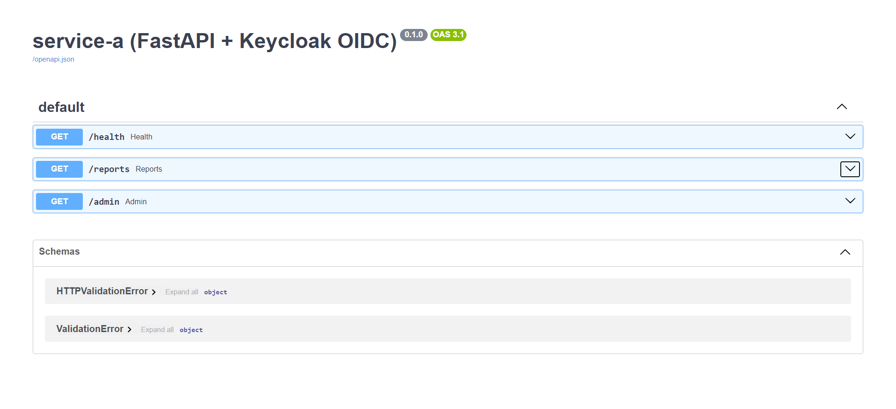
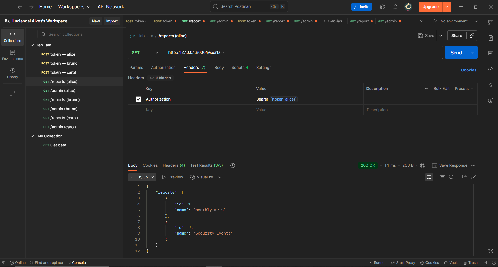
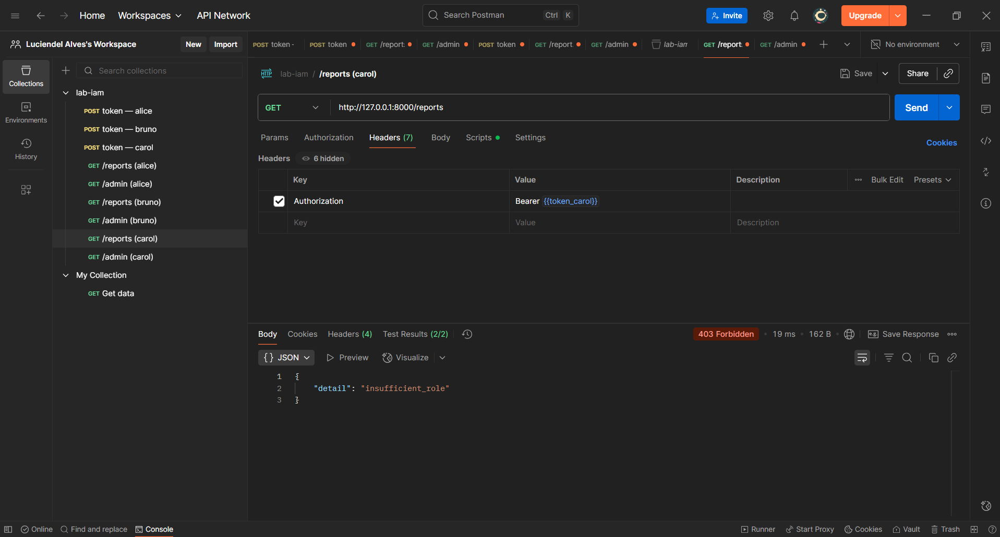
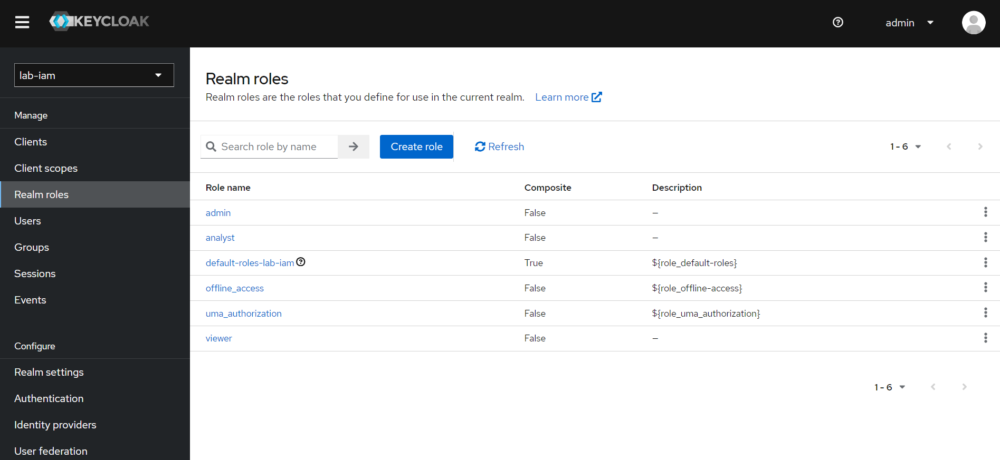
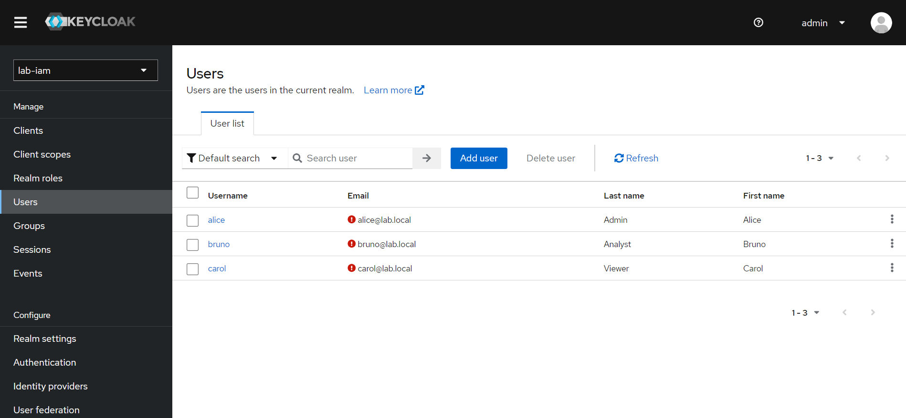
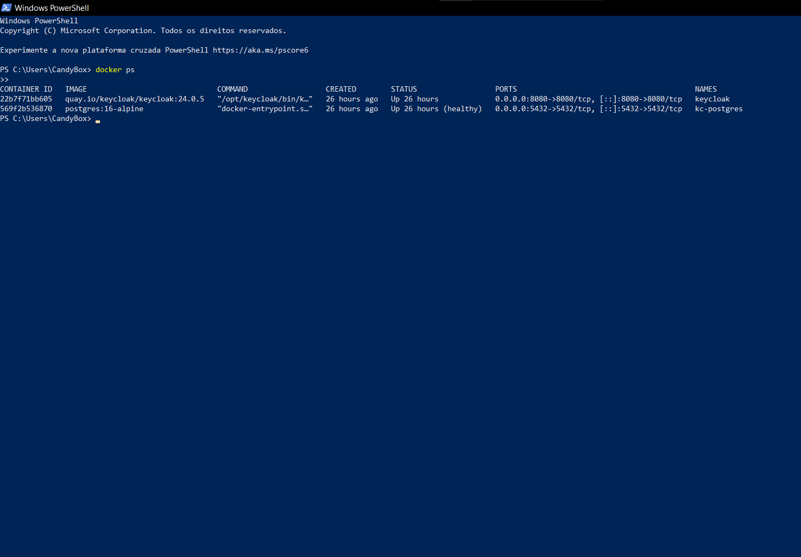

# 🔐 IAM Lab com Keycloak + FastAPI (RBAC)

Projeto de laboratório para demonstrar **controle de acesso baseado em papéis (RBAC)** usando **Keycloak 24**, **FastAPI** e **Docker Compose**.  
Inclui autenticação via Keycloak, API protegida com JWT, e testes automatizados no Postman.

---

## 🚀 Stack
- Keycloak 24 (IAM)
- PostgreSQL (storage do Keycloak)
- FastAPI (API protegida)
- Docker Compose (infra)
- Postman (coleção de testes)

---

## ⚙️ Estrutura do Projeto
```bash
keycloak-lab/
├── docs/              # prints ou diagramas
├── keycloak/          # configs relacionadas ao Keycloak
├── postman/           # coleção de testes (JSON)
├── service-a/         # API FastAPI (service-a)
├── docker-compose.yml # sobe Keycloak + Postgres
├── .gitignore
└── README.md
```
---

## 🛠️ Setup

### 1. Subir Keycloak + Postgres
docker-compose up -d

### 2. Rodar a API
cd service-a
uvicorn main:app --reload

---

## 🔑 Configuração no Keycloak
- Realm: lab-iam
- Roles (realm):  
  - admin  
  - analyst  
  - viewer  
- Usuários:
  - alice / Senha!123 → admin
  - bruno / Senha!123 → analyst
  - carol / Senha!123 → viewer
- Client: lab-api (public, Direct Access Grants = ON)
- Issuer: http://localhost:8080/realms/lab-iam

---

## 📡 API (FastAPI)
Rota       | Método | Proteção
-----------|--------|----------------------
/health    | GET    | Pública
/reports   | GET    | admin ou analyst
/admin     | GET    | apenas admin

---

## 🧪 Testes (Postman)
- Requests de token para cada usuário (alice, bruno, carol).  
- Requests para /reports e /admin com validação de status code.  
- Scripts que salvam tokens em variáveis da Collection.  
- (Opcional) Pre-request Script que renova o token automaticamente.

---

## ✅ Demonstração RBAC
Usuário | Role    | /reports | /admin
--------|---------|----------|-------
alice   | admin   | 200 OK   | 200 OK
bruno   | analyst | 200 OK   | 403
carol   | viewer  | 403      | 403

---

## 📷 Demonstração

### Rotas no Swagger


### Teste de RBAC no Postman
- Alice (admin) acessando `/reports` → **200 OK**  


- Carol (viewer) acessando `/reports` → **403 Forbidden**  


### Roles e Usuários no Keycloak
- Roles configuradas no Realm `lab-iam`  


- Usuários e suas permissões  


### Containers rodando com Docker


---

## 📌 Próximos Passos (Ideias de evolução)
- Adicionar refresh token.  
- Configurar Client Roles no lugar de Realm Roles.  
- Proteger múltiplos microservices.  
- Deploy em Kubernetes.

---

## 👨‍💻 Autor
Luciendel Alves | Estudante de Cibersegurança
